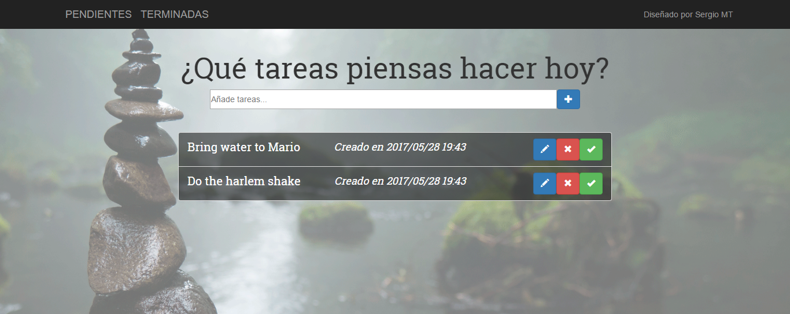

# TO-DO LIST

This repository contain a **task manager** made with **ExpressJS** and Mongoose.

To watch the project you have to _clone it_, install **npm** modules and **Bower**.

This project responds to `localhost:3000/tasks`





## Available Actions

### [**POST**] `tasks`

Add a task just giving a title value.

```bash
    curl -X POST --data "title=Do the harlem shake" localhost:3000/tasks
```

### [**DELETE**] `task/:id`

To remove elements from the task manager, you just need the id of the element.

```bash
    curl -X DELETE localhost:3000/task/592b10534828231a386a6aa5
```

### [**PUT**] `task/:id`

To edit an element you just need the id. You can change the task from _pending_ to _done_ || change the title.

```bash
curl -X PUT --data "completed=true" localhost:3000/task/592b10534828231a386a6aa5
curl -X PUT --data "title=Do the Best harlem shake" localhost:3000/task/592b10534828231a386a6aa5
```
